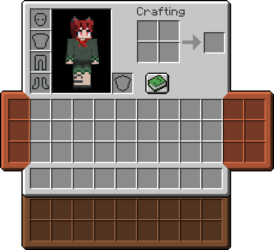

# Scout Releaded
[Modrinth](https://modrinth.com/mod/scoutreloaded)

A mod focused on "physically" extending the inventory (adding slots) through wearing various types of bags. Heavily inspired by makamys' [Satchels](https://github.com/makamys/Satchels).

Items are retained on the bag items themselves. The bag items are equipped through [Trinkets](https://github.com/emilyploszaj/trinkets) slots. A new slot type for pouches is added, with two slots.

## Future Plans
- [ ] Satchel renders on the wearer (In progress)
- [ ] Updating to 1.20+
- [x] Fixing Repository gradle repos
- [ ] Switch to Architectury

## Credits
* makamys - Original inspiration from Satchels
* Emi - Trinkets
* Kat - Original pouch texture, taken from an older mod of mine and reworked for Scout
* UTMG - Upgrading original source, (Releaded Edition)

## Building
Due to using multi-projects in Gradle and the 1.19 version depending on the 1.18 version, you will get errors trying to build normally the first time.

1. Go into `settings.gradle` and comment out `include 'platform-1.19'`
2. Build the 1.18 version
3. Uncomment the include
4. You can now build the 1.19 version

Repeat everytime version is bumped.
